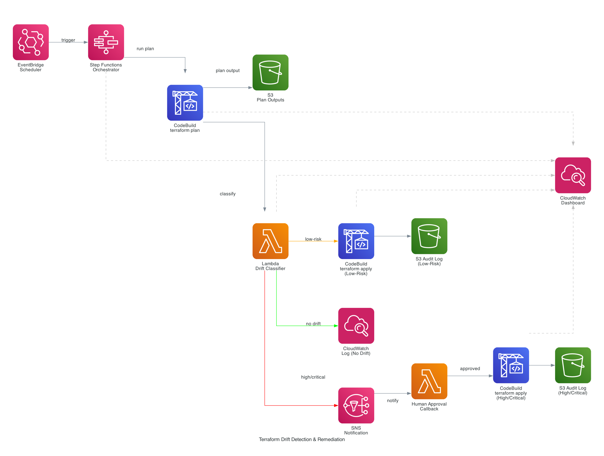

# Terraform Drift Detection and Auto-Remediation

This repository contains the code for the AWS Prescriptive Guidance pattern: **Detect and auto-remediate Terraform infrastructure drift using Amazon EventBridge, AWS CodeBuild, and AWS Step Functions**.

## Overview

A serverless pipeline that automatically detects infrastructure drift in Terraform-managed AWS environments, classifies changes by severity, and either auto-remediates low-risk drift or notifies operators for approval on high-risk changes.

**Architecture:** EventBridge (schedule) → Step Functions (orchestrator) → CodeBuild (`terraform plan`) → Lambda (classifier) → CodeBuild (`terraform apply`) or SNS (notification)



## Repository structure

```
.
├── terraform/                    # Pipeline infrastructure (deploy this)
│   ├── main.tf                   # All pipeline resources
│   ├── variables.tf              # Input variables
│   ├── outputs.tf                # Output values
│   ├── terraform.tfvars.example  # Example configuration
│   ├── buildspecs/
│   │   ├── buildspec-plan.yml    # CodeBuild: terraform plan
│   │   └── buildspec-apply.yml   # CodeBuild: terraform apply
│   └── state-machine/
│       └── definition.json       # Step Functions workflow definition
├── lambda/
│   └── classifier.py             # Drift classifier Lambda function
├── target-infra/
│   └── main.tf                   # Sample target resources for testing
├── scripts/
│   ├── introduce-drift.sh        # Simulate drift for testing
│   └── test-classifier-locally.py  # Test classifier without deploying
├── images/
│   ├── terraform_drift_detection_architecture.png
│   └── terraform_drift_detection_architecture.drawio
├── CONTRIBUTING.md
├── LICENSE
└── NOTICE
```

## Prerequisites

- AWS account with appropriate permissions
- [Terraform](https://developer.hashicorp.com/terraform/install) >= 1.5
- [AWS CLI](https://docs.aws.amazon.com/cli/latest/userguide/getting-started-install.html) >= 2.0
- Python 3.9+ (for local testing)

## Quick start

### 1. Create state backend

```bash
export PROJECT_NAME="terraform-drift-detect"
export REGION="us-east-1"
export STATE_BUCKET="${PROJECT_NAME}-state-$(aws sts get-caller-identity --query Account --output text)"

aws s3 mb "s3://${STATE_BUCKET}" --region "$REGION"
aws s3api put-bucket-versioning --bucket "$STATE_BUCKET" \
  --versioning-configuration Status=Enabled --region "$REGION"

aws dynamodb create-table \
  --table-name "${PROJECT_NAME}-locks" \
  --attribute-definitions AttributeName=LockID,AttributeType=S \
  --key-schema AttributeName=LockID,KeyType=HASH \
  --billing-mode PAY_PER_REQUEST \
  --region "$REGION"
```

### 2. Deploy target infrastructure

```bash
cd target-infra

# Uncomment and configure the backend block in main.tf with your values:
#   bucket         = "<YOUR_STATE_BUCKET>"      (e.g. terraform-drift-detect-state-123456789012)
#   key            = "target-infra/terraform.tfstate"
#   region         = "<YOUR_REGION>"            (e.g. us-east-1)
#   dynamodb_table = "terraform-drift-detect-locks"

VPC_ID=$(aws ec2 describe-vpcs --filters "Name=is-default,Values=true" \
  --query 'Vpcs[0].VpcId' --output text --region "$REGION")

terraform init
terraform apply -var="vpc_id=$VPC_ID" -auto-approve
```

### 3. Package and upload source for CodeBuild

```bash
cd target-infra
zip -r ../target-infra.zip .
cd ..
aws s3 cp target-infra.zip "s3://${STATE_BUCKET}/source/target-infra.zip"
```

### 4. Deploy the pipeline

```bash
cd terraform
cp terraform.tfvars.example terraform.tfvars
# Edit terraform.tfvars with your values

terraform init
terraform apply
```

Confirm the SNS email subscription when you receive it.

### 5. Test drift detection

```bash
# Introduce drift
chmod +x scripts/introduce-drift.sh
./scripts/introduce-drift.sh "$PROJECT_NAME" "$REGION"

# Test classifier locally
cd target-infra
terraform plan -out=plan.tfplan
terraform show -json plan.tfplan > ../drift_result.json
cd ..
python3 scripts/test-classifier-locally.py

# Or trigger the full pipeline
aws stepfunctions start-execution \
  --state-machine-arn "$(terraform -chdir=terraform output -raw state_machine_arn)"
```

### 6. Cleanup

```bash
cd terraform && terraform destroy
cd ../target-infra && terraform destroy -var="vpc_id=$VPC_ID"

aws s3 rb "s3://${STATE_BUCKET}" --force --region "$REGION"
aws dynamodb delete-table --table-name "${PROJECT_NAME}-locks" --region "$REGION"
```

## Drift classification rules

| Severity | Resource types | Action |
|----------|---------------|--------|
| **Critical** | `aws_security_group`, `aws_iam_policy`, `aws_iam_role_policy`, `aws_kms_key` | SNS notification, require approval |
| **High** | `aws_instance`, `aws_db_instance`, `aws_lambda_function`, `aws_ecs_service`, `aws_lb` | SNS notification, require approval |
| **Low** | Tag-only changes, description changes | Auto-remediate via `terraform apply` |

Customize these rules by editing `lambda/classifier.py`.

## Configuration

Key variables in `terraform/terraform.tfvars`:

| Variable | Description | Default |
|----------|-------------|---------|
| `project_name` | Resource name prefix | `terraform-drift-detect` |
| `aws_region` | Deployment region | `us-east-1` |
| `notification_email` | Email for drift alerts | — (required) |
| `schedule_expression` | Detection frequency | `rate(6 hours)` |
| `terraform_version` | Terraform version in CodeBuild | `1.9.8` |

See `terraform/variables.tf` for the full list.

## Security

- CodeBuild uses least-privilege IAM with specific actions scoped to resource ARNs where supported
- Amazon Simple Storage Service (Amazon S3) buckets have server-side encryption (SSE-KMS), Block Public Access, and TLS-only bucket policies
- AWS Key Management Service (AWS KMS) customer-managed key with key rotation enabled encrypts SNS messages and CodeBuild artifacts
- Terraform state is encrypted with DynamoDB locking
- Critical and high-risk drift requires human approval before remediation
- All plan outputs and apply logs stored in versioned S3 bucket with lifecycle expiration
- Environment variables in CodeBuild are encrypted with KMS

## License

This library is licensed under the MIT-0 License. See the [LICENSE](LICENSE) file.

## Security

See [CONTRIBUTING](CONTRIBUTING.md#security-issue-notifications) for more information.

This sample follows the [AWS Shared Responsibility Model](https://aws.amazon.com/compliance/shared-responsibility-model/). AWS manages the security of the cloud infrastructure, while you are responsible for security in the cloud — including IAM policies, encryption configuration, and network access controls deployed by this pattern.
